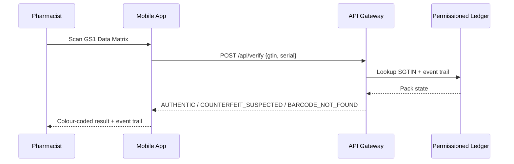

# MedAuth — Blockchain Medication Authenticity Verification

[](../../actions)
[](LICENSE)

**MedAuth** lets anyone in the pharmaceutical supply chain — manufacturer,
wholesaler, pharmacy, or a read-only regulator — verify in under a second
whether a medication pack is genuine, using a **permissioned blockchain
ledger** (Hyperledger Fabric) and a **zero-PII-on-chain** design.

> Built from the MIS611 Group 3 project brief — this repository implements
> the working pilot: API gateway, Fabric chaincode, and mobile app.

## Why MedAuth

Counterfeit medicines put patients at risk and are hard to catch with
paper-based or siloed digital records. MedAuth gives every hand-off in
the supply chain — commission → ship → receive → dispense — an
append-only, tamper-evident record, while keeping personal and sensitive
data completely off the ledger.

## How verification works



Result states are never colour-only — each pairs an icon, a colour, and
plain-language text (WCAG 2.1 AA):

| State | Meaning |
|---|---|
| 🟢 **Authentic** | Found on-ledger, unexpired, dispensed at most once |
| 🔴 **Counterfeit suspected** | Expired, or a duplicate-dispense pattern detected |
| 🟡 **Barcode not found** | No matching pack was ever commissioned |

## Repository structure

```
medauth-blockchain-drug-verification/
├── backend/            API gateway — RBAC/OTP auth, GS1 validation, KPI metrics,
│                        local permissioned-ledger simulation for dev/demo
├── chaincode/
│   ├── medauth-pack-lifecycle/   The real Hyperledger Fabric smart contract
│   └── network/                 Fabric deployment guide + example connection profile
├── mobile-app/         Expo / React Native scan-and-verify client
├── docs/               Architecture, GS1/EPCIS mapping, security model, KPIs, API reference
└── .github/workflows/  CI — backend + chaincode tests, mobile typecheck
```

## Quickstart (local demo — no Fabric network required)

```bash
# 1. Backend API + simulated permissioned ledger
cd backend
npm install
cp .env.example .env
npm run seed        # creates demo orgs + a full sample pack lifecycle
npm run dev          # http://localhost:4000

# 2. Try it
curl -X POST http://localhost:4000/api/auth/otp/request \
  -H 'Content-Type: application/json' \
  -d '{"identifier":"pharmacist@citypharmacy.demo"}'
# -> use the returned devCode with /api/auth/otp/verify to get a token, then:
curl -X POST http://localhost:4000/api/verify \
  -H "Authorization: Bearer <token>" -H 'Content-Type: application/json' \
  -d '{"gtin":"9506000134352","serial":"SN-100001"}'
```

```bash
# 3. Mobile app (Expo)
cd mobile-app
npm install
npm start
```

Point the app at your backend via `EXPO_PUBLIC_API_BASE_URL` (defaults to
`http://localhost:4000`).

## Deploying the real Fabric chaincode

The backend ships with a local ledger **simulation** so the whole system
runs without standing up Fabric first. To deploy the actual smart
contract to a permissioned Hyperledger Fabric network, see
[`chaincode/network/README.md`](chaincode/network/README.md). The
validation rules are identical between the simulation
(`backend/src/ledger/chaincode.js`) and the real chaincode
(`chaincode/medauth-pack-lifecycle/lib/packLifecycle.js`) — only the
transport changes.

## Testing

```bash
cd backend && npm test                              # 17 tests
cd chaincode/medauth-pack-lifecycle && npm test      # 6 tests
cd mobile-app && npm run typecheck
```

## Documentation

- [Architecture](docs/architecture.md)
- [GS1 / EPCIS mapping](docs/gs1-epcis-mapping.md)
- [Security model](docs/security.md)
- [KPI envelope](docs/kpis.md)
- [API reference](docs/api-reference.md)
- [Contributing](CONTRIBUTING.md)

## License

MIT — see [LICENSE](LICENSE).
