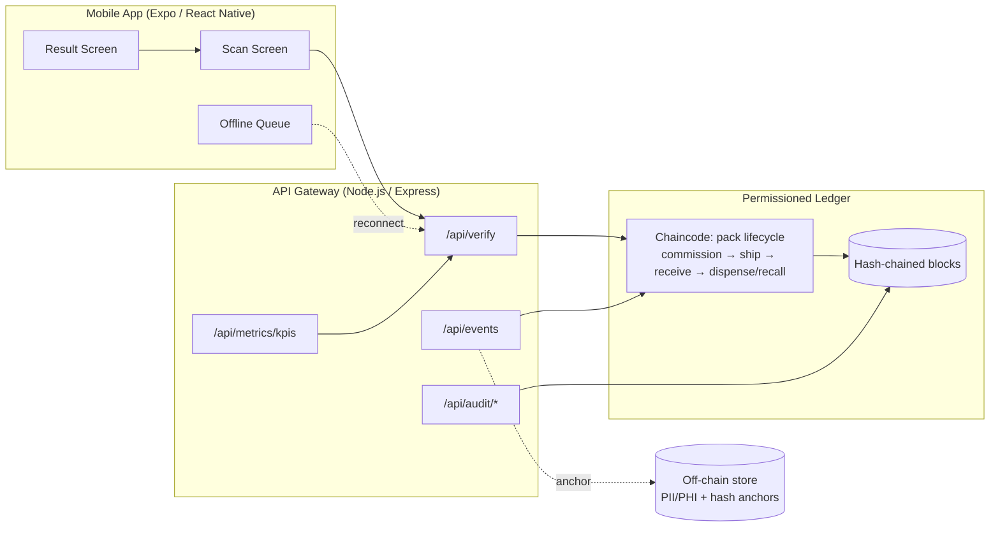

# Architecture

## Overview

MedAuth pairs a **permissioned blockchain ledger** (Hyperledger Fabric)
with a **mobile-first verification app**, so any actor in the supply
chain — manufacturer, wholesaler, pharmacy, or a read-only regulator —
can prove a medication pack is genuine in under a second, without ever
exposing patient or personal data on-chain.

## Components

| Component | Responsibility |
|---|---|
| `mobile-app/` | Scan-first UX: camera-based GS1 scan, OTP login, offline queue + reconciliation, event-trail viewer, help center |
| `backend/` | API gateway: RBAC/JWT, GS1 validation, KPI metrics, local permissioned-ledger simulation used for dev/pilot demo |
| `chaincode/medauth-pack-lifecycle/` | The actual Hyperledger Fabric smart contract — authoritative validation + zero-PII guard, deployable to a real Fabric channel |
| `chaincode/network/` | Deployment guide + example connection profile for a real Fabric test network |

## Why a local ledger simulation *and* real Fabric chaincode?

The pilot needs to run end-to-end (mobile ↔ API ↔ ledger) without every
reviewer standing up a multi-org Fabric network first. `backend/src/ledger/permissionedLedger.js`
reproduces Fabric's core guarantee — an append-only, hash-chained,
tamper-evident block sequence — using SQLite, and `backend/src/ledger/chaincode.js`
mirrors the exact same validation rules implemented for real in
`chaincode/medauth-pack-lifecycle/lib/packLifecycle.js`. Swapping the
simulated ledger for a Fabric Gateway SDK client is a transport-layer
change only (see `chaincode/network/README.md`, step 4) — none of the
business rules move.

## Data model: privacy-first partitioning

- **On-chain**: GTIN/SGTIN, lot, expiry, serial, `bizStep`, org, block
  hash chain, and content-hash *anchors* of any off-chain artefact.
- **Off-chain** (`backend/src/models/offChainStore.js`): anything that
  could identify a person — dispensing context, supporting documents —
  stored separately, with only its SHA-256 hash written on-chain.
- A defence-in-depth **zero-PII guard** runs at both layers
  (`assertZeroPii` in the API gateway *and* in the chaincode itself),
  so no single component failure can leak PII onto the ledger.

## Verification decision logic

`POST /api/verify` (and the chaincode's `QueryPack`/`GetEventTrail`
equivalents) resolve a scan into exactly one of three states:

1. **Authentic** — pack found, unexpired, dispensed at most once.
2. **Counterfeit suspected** — expired, or a duplicate-dispense pattern
   detected (possible cloned/reused serial).
3. **Barcode not found** — no matching SGTIN has ever been commissioned.

## KPI envelope

`GET /api/metrics/kpis` computes p95 verify latency and throughput live
from request samples, against the pilot's success-matrix targets
(p95 ≤ 1.0s, ≥ 25 TPS, ≥ 99.9% availability) — see `docs/kpis.md`.
